

<div align="center">

<a href="https://github.com/nima1991zare">
  
</a>


<a href="https://nimabuilds.pythonanywhere.com/"></a>

</div>

```python
class NimaZare(Developer):
    """Full-Stack × AI Developer — I turn ideas into deployed systems."""

    location   = "Iran 🇮🇷"
    languages  = ["English", "Persian (فارسی)"]
    role       = "Full-Stack Developer — AI & Back-End focus"

    ai         = ["TensorFlow", "OpenCV", "Image Processing", "Computer Vision"]
    backend    = ["Python", "Django", "FastAPI", "SQLAlchemy 2.0", "PostgreSQL", "asyncio"]
    bots       = ["aiogram v3", "Telethon", "crypto-payment automation (TRON · TON)"]
    also_ships = ["Rust systems", "Flutter apps", "Godot games", "web front-ends"]
    devops     = ["Docker", "docker-compose", "Linux", "Git", "APScheduler"]

    async def build(self, idea):
        while idea.alive():
            await self.ship(production_code)   # 24/7
```


## `> ls ./what_i_do`

- 🧠 **AI & Computer Vision** — TensorFlow models, OpenCV pipelines, image processing & edge detection
- ⚙️ **Back-End Engineering** — clean, production-ready Python: Django, FastAPI, SQLAlchemy 2.0, PostgreSQL, async architectures
- 🤖 **Telegram Bot Automation** — subscription bots, content bots, Instagram DM order automation — fully Dockerized
- 💸 **Crypto Payment Systems** — on-chain **USDT payment verification (TRON TRC-20 + TON)** — watch-only, no private keys, auto invite links, expiry auto-kick, renewal reminders
- 🦀 **Systems Programming** — built a Redis-compatible in-memory store in **Rust** (RESP2, 16-shard storage, TTL, pub/sub, AOF persistence)
- 📱 **Mobile Apps** — Flutter apps for Android / iOS / Windows (calorie tracking, AI styling)
- 🎮 **Game Dev** — Godot 4 music-driven runner with offline audio analysis + HTML5 canvas games
- 📊 **Data Dashboards** — AI-powered 14-module Streamlit dashboard automating Amazon.ae seller operations end-to-end

## `> cat tech_stack.txt`

#### AI / ML
<p>


</p>

#### Back-End
<p>


</p>

#### Front-End & Mobile
<p>


</p>

#### Systems, Games & DevOps
<p>


</p>

## `> ls ./featured_projects`

| Project | What it is | Stack |
|---------|-----------|-------|
| 🔐 [**Telegram Paid-Channel Bot**](https://github.com/nima1991zare/Telegram-Paid-Channel-Subscription-Bot-with-USDT-Auto-Payment) | Sells private-channel subscriptions with **fully automated on-chain USDT verification (TRON + TON)** — watch-only, auto invite links, expiry auto-kick, renewal reminders, admin panel, EN/FA i18n | `aiogram v3` `SQLAlchemy 2.0` `APScheduler` `Docker` |
| 🦀 [**rudis**](https://github.com/nima1991zare/rudis) | Redis-compatible in-memory key-value store built from scratch — RESP2 protocol, 16-shard storage, TTL, pub/sub, AOF persistence | `Rust` |
| 📊 [**Amazon Dashboard**](https://github.com/nima1991zare/Amazon_Dashboard) | AI-powered **14-module dashboard** centralizing & automating end-to-end Amazon.ae seller operations | `Python` `Streamlit` `AI` |
| 📈 [**Nima Trading Panel**](https://github.com/nima1991zare/Nima-Trading-Panel) | Automated crypto trading panel with charts, data pipeline and a Node server | `JavaScript` `Vite` `Tailwind` |
| 🍎 [**Calories Counter**](https://github.com/nima1991zare/Calories-Counter) | Nutrition tracking app — food diary, **barcode scanner + OpenFoodFacts API**, recipes, biometrics, trends & reports | `Flutter` `Dart` |
| 👗 [**Aura Stylist**](https://github.com/nima1991zare/Style-App-) | Personal stylist app — wardrobe manager, **personal color analysis**, outfit suggestion & rating engine | `Flutter` `Dart` |
| 🎵 [**Sound Dash**](https://github.com/nima1991zare/Sound-Dash-Game) | 3D music-driven auto-runner — analyzes **any MP3/OGG/WAV offline** and builds levels from beats & frequency bands | `Godot 4.4` `GDScript` |
| 🏃 [**Draw Runner**](https://github.com/nima1991zare/Draw-runner-Game) · [▶ play live](https://nima1991zare.github.io/Draw-runner-Game/) | HTML5 canvas game — you **draw the terrain** your runner rides on. Single file, zero dependencies | `JavaScript` `Canvas` |
| 💄 [**FAMA Cosmetics**](https://github.com/nima1991zare/Cosmetics-Website) · [🌐 view live](https://nima1991zare.github.io/Cosmetics-Website/) | Persian (RTL) online cosmetics store — catalog, product pages, vanilla front-end | `HTML` `CSS` `JS` |
| ✅ [**TODO Java**](https://github.com/nima1991zare/TODO_Liat-JAVA) | Task management application | `Java` |

## `> ./github_stats --render`

<div align="center">


</div>

## `> ./contact --open-channel`

<div align="center">

<a href="https://nimabuilds.pythonanywhere.com/"></a>
<a href="https://github.com/nima1991zare"></a>

</div>


